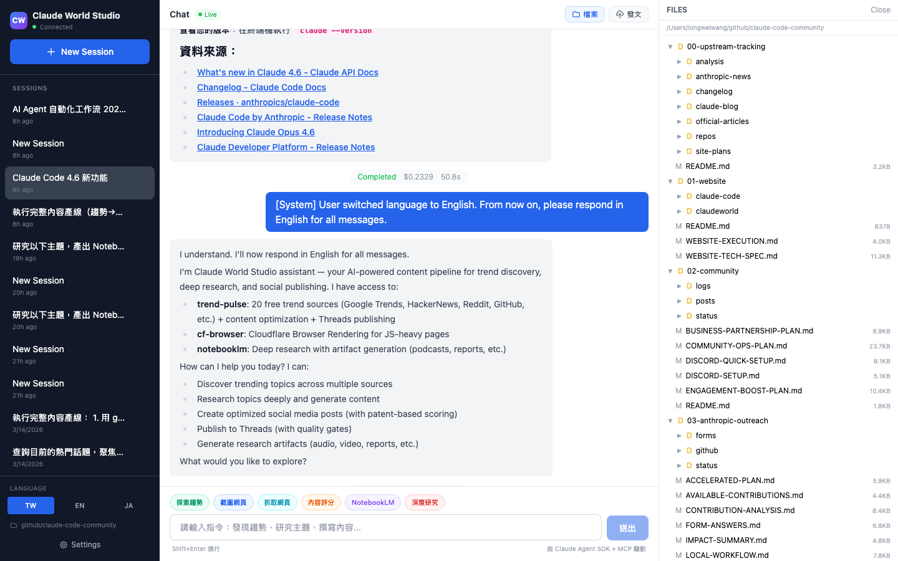

# Claude World Studio

AI-powered content pipeline: from trend discovery to social publishing.

Built with **Claude Agent SDK + MCP** (Model Context Protocol), featuring 3 integrated MCP servers for real-time trends, web scraping, and research automation.


## Features

### One-Stop Pipeline

Three clear entry points — no complex menus, just pick and go:


| Card | Action | What happens |
|------|--------|-------------|
| **Freestyle** | One click, zero input | Auto: trends → read source → verify timeline → patent score → publish |
| **Custom Topic** | Type your topic | Deep research → score → publish |
| **Custom + Media** | Type your topic | Research → NotebookLM slides/video/podcast → publish |

### Live Agent Execution

Watch Claude work in real-time — tool calls are shown as collapsible blocks with MCP server badges:


- **trend-pulse** (green) — 20 real-time trend sources, zero auth
- **cf-browser** (blue) — Cloudflare Browser Rendering for JS pages
- **notebooklm** (purple) — Research + artifact generation (podcast/slides/video)

### Rich Markdown Responses

Full markdown rendering with syntax highlighting, clickable links, and inline file previews:


### File Explorer + Preview

Browse workspace files with inline image thumbnails. Click any file to open a full-screen preview modal (images, PDFs, audio, video, text):



### Multi-Language (i18n)

Full support for Traditional Chinese, English, and Japanese — pipeline cards, chips, UI labels, and system prompts all adapt:

<table>
<tr>
<td></td>
<td></td>
<td></td>
</tr>
<tr>
<td align="center">ZH-TW</td>
<td align="center">English</td>
<td align="center">Japanese</td>
</tr>
</table>

### Meta Patent-Based Scoring

Every post is checked against Meta's 7 ranking patents before publishing:

| Dimension | Patent | What it checks |
|-----------|--------|---------------|
| Hook Power | EdgeRank | First line has number or contrast? (10-45 chars) |
| Engagement Trigger | Dear Algo | CTA anyone can answer? |
| Conversation Durability | 72hr window | Has both sides / contrast? |
| Velocity Potential | Andromeda | Short enough? Timely? |
| Format Score | Multi-modal | Mobile-scannable? |

Quality gates: Overall >= 70, Conversation Durability >= 55.

## Architecture

```
┌─────────────┐     ┌──────────────────┐     ┌─────────────────┐
│  React UI   │────▶│  Express + WS    │────▶│  Claude Agent   │
│  (Vite)     │◀────│  Server          │◀────│  SDK (Sonnet)   │
└─────────────┘     └──────────────────┘     └────────┬────────┘
                                                      │
                           ┌──────────────────────────┤
                           │            │             │
                    ┌──────▼──┐  ┌──────▼───┐  ┌─────▼──────┐
                    │ trend-  │  │ cf-      │  │ notebooklm │
                    │ pulse   │  │ browser  │  │            │
                    │ (MCP)   │  │ (MCP)    │  │ (MCP)      │
                    └─────────┘  └──────────┘  └────────────┘
                    20 sources    Cloudflare    Podcast/Slides
                    zero auth     Browser       /Video/Report
```

## Tech Stack

| Layer | Tech |
|-------|------|
| Frontend | React 18 + Vite + Tailwind CSS |
| Backend | Express + WebSocket + Claude Agent SDK |
| AI | Claude Sonnet 4.6 (bypassPermissions, local only) |
| MCP Servers | trend-pulse, cf-browser, notebooklm |
| Database | SQLite (better-sqlite3) |
| Rendering | react-markdown + rehype-sanitize |

## Quick Start

```bash
# Clone
git clone https://github.com/claude-world/claude-world.com.git
cd claude-world-studio

# Install
npm install

# Configure
cp .env.example .env
# Edit .env with your MCP server paths

# Run
npm run dev
# Opens at http://localhost:5173
```

## Security

- Server binds to `127.0.0.1` only (not exposed to network)
- WebSocket origin verification (exact port whitelist)
- CORS restricted to localhost dev ports
- File API: async realpath + workspace containment check (TOCTOU-safe)
- Path traversal rejected on both client and server
- `rehype-sanitize` for XSS protection in markdown rendering
- Session isolation: WS messages filtered by sessionId
- Idle session eviction (30min TTL)

## License

Private project. Not open source.
