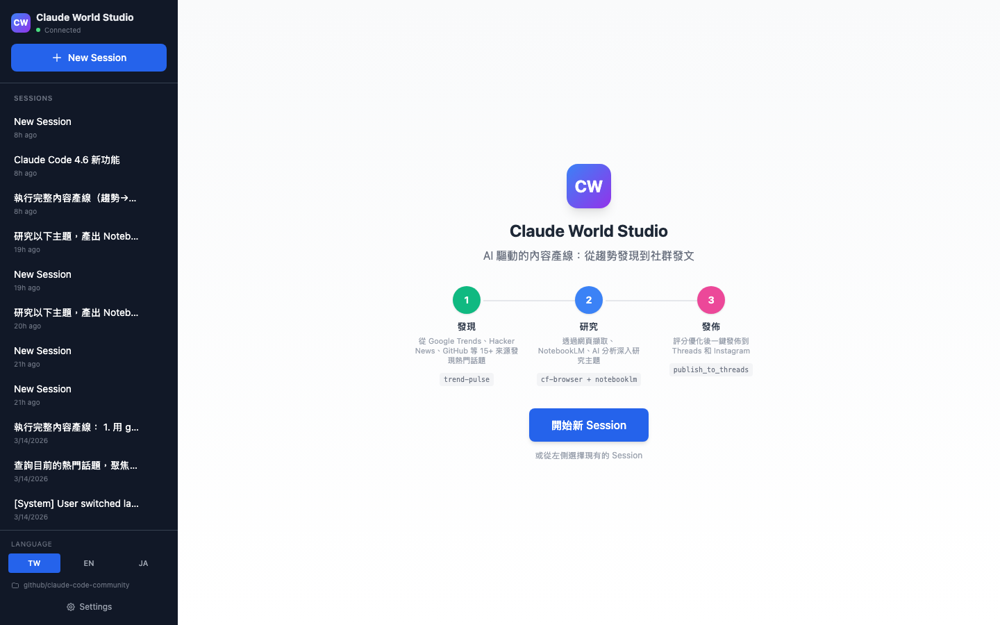
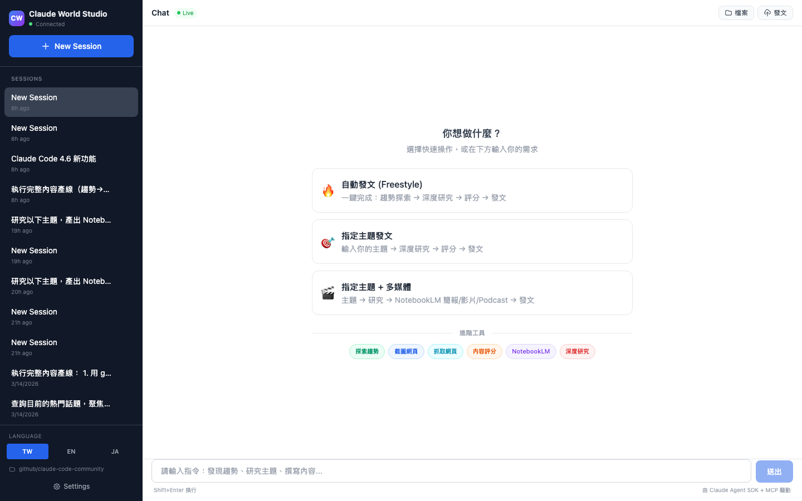
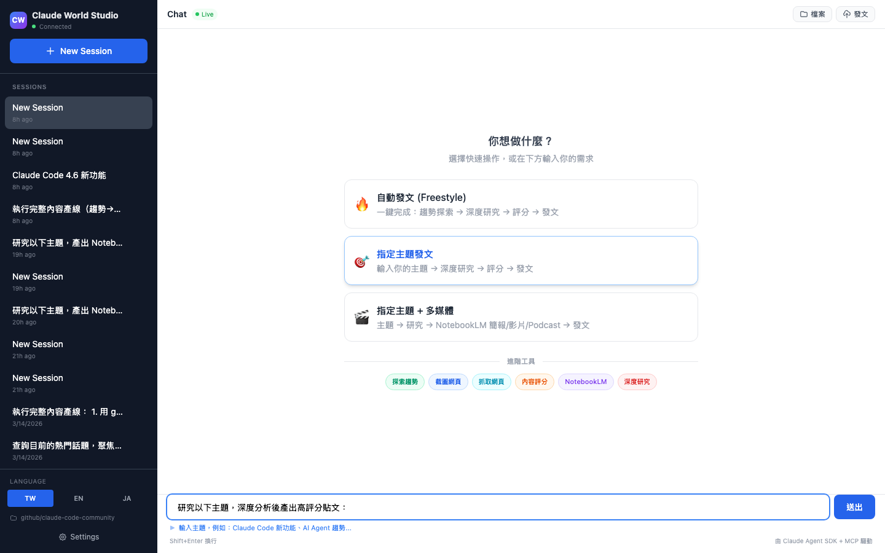
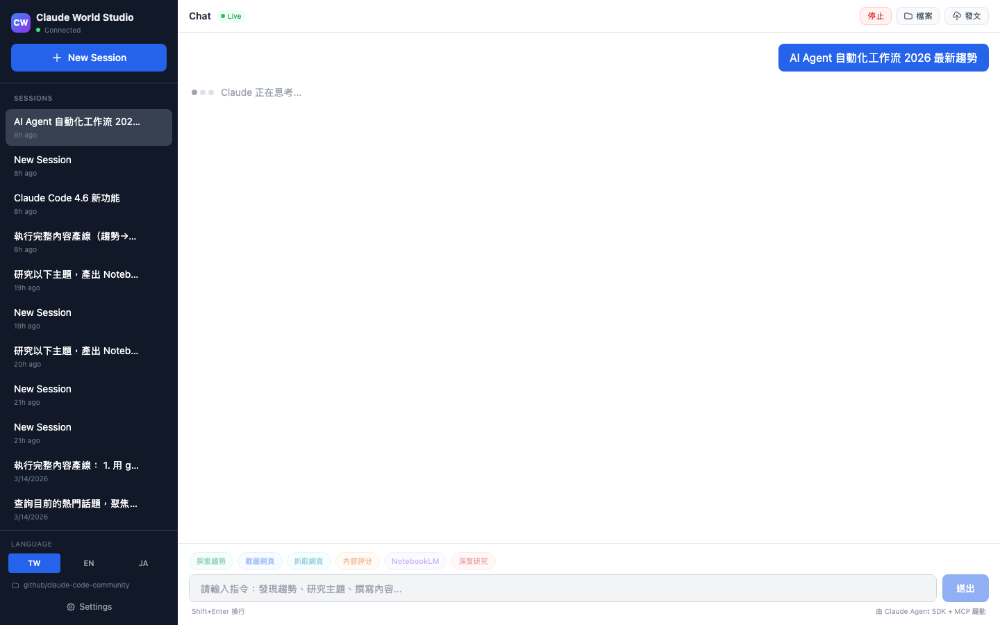
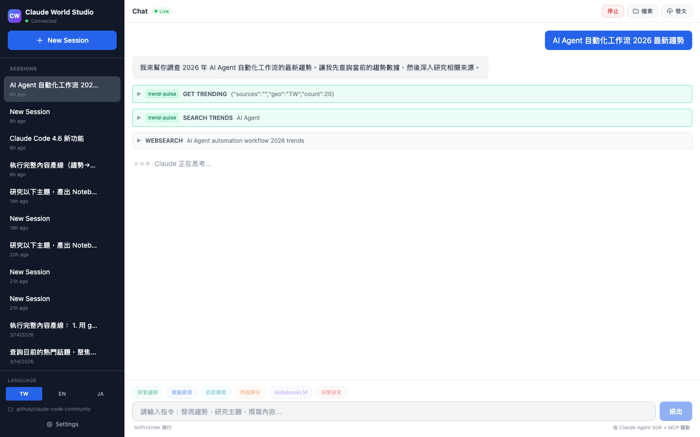
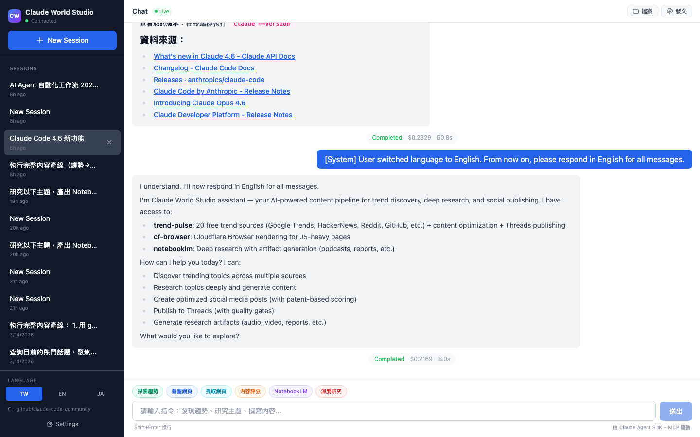
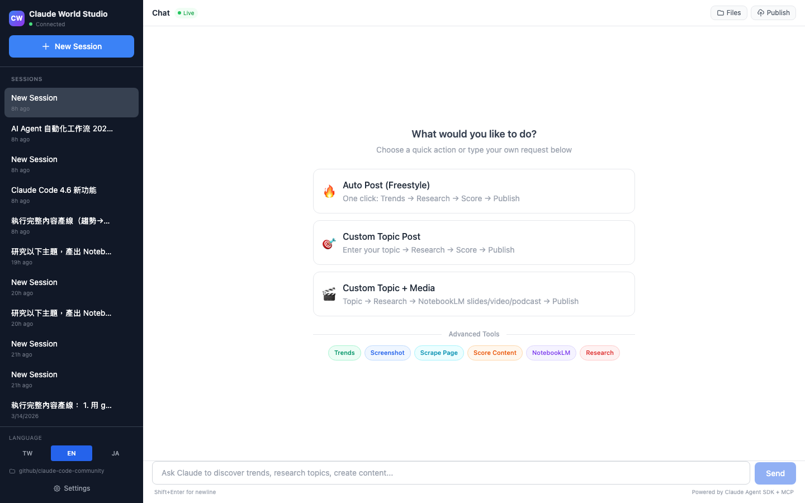
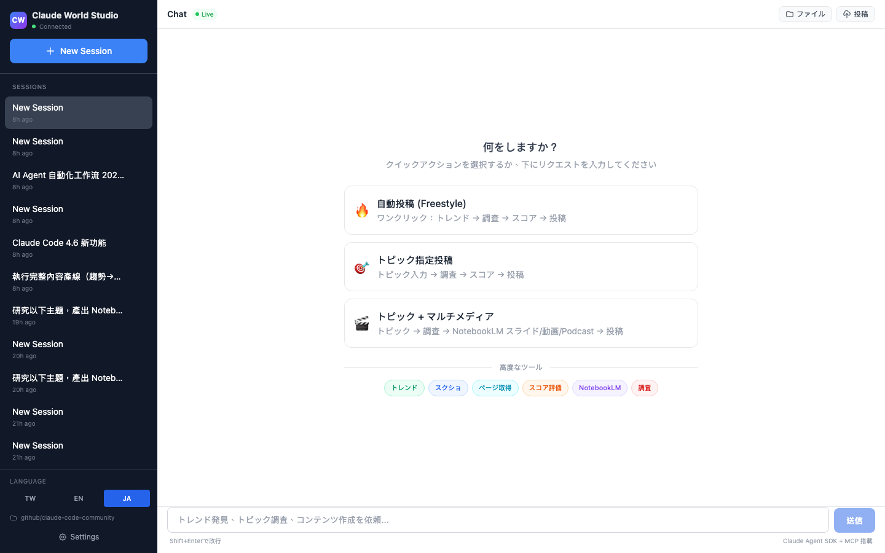

# Claude World Studio

AI-powered content pipeline: from trend discovery to social publishing.

Built with **Claude Agent SDK + MCP** (Model Context Protocol), featuring 3 integrated MCP servers for real-time trends, web scraping, and research automation.



## Features

### One-Stop Pipeline

Three clear entry points — no complex menus, just pick and go:



| Card | Action | What happens |
|------|--------|-------------|
| **Freestyle** | One click, zero input | Auto: trends → read source → verify timeline → patent score → publish |
| **Custom Topic** | Type your topic | Deep research → score → publish |
| **Custom + Media** | Type your topic | Research → NotebookLM slides/video/podcast → publish |

### Smart Input Fill

Click "Custom Topic" and the input auto-fills with a template prompt. A hint guides what to type:



### Live Agent Execution

Watch Claude work in real-time — tool calls shown as collapsible blocks with MCP server badges. Loading state keeps the Stop button visible throughout long operations:





- **trend-pulse** (green) — 20 real-time trend sources, zero auth
- **cf-browser** (blue) — Cloudflare Browser Rendering for JS pages
- **notebooklm** (purple) — Research + artifact generation (podcast/slides/video)

### Rich Markdown Responses

Full markdown rendering with syntax highlighting, clickable source links, cost/duration tracking, and inline file path previews:



### Multi-Language (i18n)

Full support for Traditional Chinese, English, and Japanese — all pipeline cards, chips, UI labels, system prompts, and placeholder text adapt:

<table>
<tr>
<td></td>
<td></td>
</tr>
<tr>
<td align="center">English</td>
<td align="center">Japanese</td>
</tr>
</table>

### Social Publishing

Built-in publish flow with Meta's patent-based scoring. Every post is checked against 5 ranking dimensions before publishing:

| Dimension | Patent | What it checks |
|-----------|--------|---------------|
| Hook Power | EdgeRank | First line has number or contrast? (10-45 chars) |
| Engagement Trigger | Dear Algo | CTA anyone can answer? |
| Conversation Durability | 72hr window | Has both sides / contrast? |
| Velocity Potential | Andromeda | Short enough? Timely? |
| Format Score | Multi-modal | Mobile-scannable? |

Quality gates: Overall >= 70, Conversation Durability >= 55. Supports `--poll` for native polls, `--link-comment` to avoid URL reach penalty.

### Scheduled Tasks

Cron-based task scheduling with per-account targeting:

- Define prompt templates with cron schedules
- Target specific social accounts
- Quality gate enforcement (min score threshold)
- Auto-publish or manual review mode
- Execution history with cost/duration tracking

### Source Verification & Timeline Rules

Content integrity is enforced at the system level:

- **Read original sources** — Never write from titles/metadata alone. At least 1 primary source per topic, 2+ for controversial topics.
- **Timeline verification** — Every fact gets a verified timestamp. Time words are mapped by age (today = "just now", 1-3 days = "recently", etc.).
- **No AI filler** — System prompt blocks generic phrases like "in today's world" / "it's worth noting".

## Architecture

```
┌─────────────┐     ┌──────────────────┐     ┌─────────────────┐
│  React UI   │────▶│  Express + WS    │────▶│  Claude Agent   │
│  (Vite)     │◀────│  Server          │◀────│  SDK            │
└─────────────┘     └──────────────────┘     └────────┬────────┘
                                                      │
                           ┌──────────────────────────┤
                           │            │             │
                    ┌──────▼──┐  ┌──────▼───┐  ┌─────▼──────┐
                    │ trend-  │  │ cf-      │  │ notebooklm │
                    │ pulse   │  │ browser  │  │            │
                    │ (MCP)   │  │ (MCP)    │  │ (MCP)      │
                    └─────────┘  └──────────┘  └────────────┘
                    20 sources    Cloudflare    Podcast/Slides
                    zero auth     Browser       /Video/Report
```

## Tech Stack

| Layer | Tech |
|-------|------|
| Frontend | React 18 + Vite + Tailwind CSS |
| Backend | Express + WebSocket + Claude Agent SDK |
| AI Model | Claude Sonnet 4.6 / Opus 4.6 |
| MCP Servers | trend-pulse, cf-browser, notebooklm |
| Database | SQLite (better-sqlite3) |
| Desktop | Electron 41 |
| Markdown | react-markdown + rehype-sanitize |

## Prerequisites

- **Node.js** >= 18
- **Claude Code CLI** installed and authenticated (`npm install -g @anthropic-ai/claude-code`)
- **Python** 3.10+ (for MCP servers — or use `uvx` for zero-config setup)

---

## Installation

Five ways to install — pick the one that fits your workflow:

| Method | Best for | MCP Servers | Web UI | Desktop App | CLI |
|--------|----------|-------------|--------|-------------|-----|
| [A. Mac Desktop](#option-a-mac-desktop-app-download) | Quickest start | via uvx | Built-in | Yes | Yes |
| [B. npm](#option-b-npm-global) | Most users | via uvx | Yes | — | Yes |
| [C. Source](#option-c-from-source) | Contributors | venv or uvx | Yes | — | Yes |
| [D. Build Desktop](#option-d-build-desktop-from-source) | Custom builds | via uvx | Built-in | Yes | Yes |
| [E. MCP-only](#option-e-mcp-only-for-claude-code-cli) | Claude Code users | via uvx | — | — | — |

### Option A: Mac Desktop App (Download)

Download the latest `.dmg` from [GitHub Releases](https://github.com/claude-world/claude-world-studio/releases/latest), open it, and drag to Applications.

- Double-click to launch — server starts automatically
- No terminal, no Node.js install needed
- MCP servers auto-detected via uvx (install [uv](https://docs.astral.sh/uv/) first)
- All features included: Web UI + CLI + MCP + Publishing

> **Requires**: macOS (Apple Silicon). Intel Mac build available on request.

### Option B: npm global

```bash
npm install -g @claude-world/studio

# Set up MCP servers (one-time, auto-cached via uvx)
npx @claude-world/studio setup-mcp

# Start
studio serve
# Web UI: http://localhost:5173
# API:    http://127.0.0.1:3001
```

After install, both `studio` and `claude-world-studio` commands are available globally.

### Option C: From source

```bash
git clone https://github.com/claude-world/claude-world-studio.git
cd claude-world-studio
npm install
cp .env.example .env

# Set up MCP servers
# Option 1: uvx (preferred — no clone, no path config)
npx @claude-world/studio setup-mcp

# Option 2: venv (legacy — clones repos, requires path config)
npx @claude-world/studio setup-mcp --venv

# Start development
npm run dev
# Frontend: http://localhost:5173
# Backend:  http://127.0.0.1:3001
```

Use `node bin/cli.js <command>` or `npm link` to register the `studio` command.

### Option D: Build Desktop from source

Build the native macOS app yourself:

```bash
git clone https://github.com/claude-world/claude-world-studio.git
cd claude-world-studio
npm install

# Development mode (quick test)
npm run electron:dev

# Production build (creates .app + .dmg)
npm run electron:build
# Output: dist/mac-arm64/Claude World Studio.app
```

The Electron app:
- Spawns the Express server automatically on launch
- Loads your login shell PATH (nvm/homebrew compatible)
- Rebuilds native modules (better-sqlite3) for system Node ABI
- Supports all MCP servers (auto-detected via uvx or .env)

### Option E: MCP-only (for Claude Code CLI)

If you already use Claude Code CLI and just want the MCP tools (trend-pulse, cf-browser, notebooklm) without the Studio UI:

```bash
# Install MCP servers via uvx (one-time)
uvx --from 'trend-pulse[mcp]' trend-pulse-server --help
uvx --from cf-browser-mcp cf-browser-mcp --help
uvx --from notebooklm-skill notebooklm-mcp --help
```

Add to your project's `.mcp.json`:

```json
{
  "mcpServers": {
    "trend-pulse": {
      "type": "stdio",
      "command": "uvx",
      "args": ["--from", "trend-pulse[mcp]", "trend-pulse-server"]
    },
    "cf-browser": {
      "type": "stdio",
      "command": "uvx",
      "args": ["--from", "cf-browser-mcp", "cf-browser-mcp"]
    },
    "notebooklm": {
      "type": "stdio",
      "command": "uvx",
      "args": ["--from", "notebooklm-skill", "notebooklm-mcp"]
    }
  }
}
```

Or add to Claude Desktop App config (`~/Library/Application Support/Claude/claude_desktop_config.json`) with the same format.

---

## MCP Server Setup

The app uses 3 MCP servers — **all optional**, the app works with any combination.

### Quick Setup (uvx — recommended)

If you have `uv` installed ([install uv](https://docs.astral.sh/uv/)), the setup wizard handles everything:

```bash
npx @claude-world/studio setup-mcp
```

This pre-caches all 3 servers via uvx. No cloning, no path config. Studio auto-detects uvx at runtime.

To update cached servers:

```bash
npx @claude-world/studio setup-mcp --update
```

### Manual Setup (venv)

For users who prefer local venvs or need custom paths:

#### trend-pulse (Trend Discovery) — Recommended

Real-time trends from 20 sources (Google Trends, HN, Reddit, GitHub, etc). **Zero API keys needed.**

```bash
git clone https://github.com/claude-world/trend-pulse.git
cd trend-pulse
python3 -m venv .venv
.venv/bin/pip install -e ".[mcp]"
```

Add to `.env`:
```
TREND_PULSE_PYTHON=/absolute/path/to/trend-pulse/.venv/bin/python
```

#### cf-browser (Web Scraping) — Recommended

Cloudflare Browser Rendering for reading JS-rendered pages. Two modes available:

**Mode 1: Cloudflare API (cf-api)** — Uses your Cloudflare account directly (recommended):
```bash
git clone https://github.com/claude-world/cf-browser.git
cd cf-browser/mcp-server
python3 -m venv .venv
.venv/bin/pip install -e ../sdk && .venv/bin/pip install -e .
```

Add to `.env`:
```
CF_BROWSER_PYTHON=/absolute/path/to/cf-browser/mcp-server/.venv/bin/python
CF_ACCOUNT_ID=your-cloudflare-account-id
CF_API_TOKEN=your-cloudflare-api-token
```

**Mode 2: Worker** — Uses a deployed Cloudflare Worker:
```bash
# Same install as above, plus deploy the Worker
cd cf-browser
bash setup.sh
```

Add to `.env`:
```
CF_BROWSER_PYTHON=/absolute/path/to/cf-browser/mcp-server/.venv/bin/python
CF_BROWSER_URL=https://your-cf-browser.workers.dev
CF_BROWSER_API_KEY=your-api-key
```

See [cf-browser README](https://github.com/claude-world/cf-browser) for full Cloudflare setup.

#### notebooklm (Research + Media) — Optional

Google NotebookLM integration for podcast, slides, video generation. Requires a Google account.

```bash
git clone https://github.com/claude-world/notebooklm-skill.git
cd notebooklm-skill
python3 -m venv .venv
.venv/bin/pip install notebooklm-py playwright fastmcp python-dotenv httpx
python3 scripts/auth_helper.py    # One-time Google login
```

Add to `.env`:
```
NOTEBOOKLM_SERVER_PATH=/absolute/path/to/notebooklm-skill/mcp-server/server.py
```

### MCP Auto-Detection

Studio resolves MCP servers in this order:

1. **Settings UI** — paths configured via Settings page (stored in SQLite)
2. **Environment variables** — `.env` file or exported vars
3. **uvx fallback** — if `uvx` is on PATH, uses cached packages automatically

The app auto-detects which MCP servers are configured and enables them. Unconfigured servers are silently skipped.

Use `studio settings detect` (CLI) or **Settings > Scan System** (UI) to check what's available.

---

## Production Pipeline: End-to-End

Here's how to connect the full pipeline from installation to automated publishing.

### Step 1: Install & Configure

```bash
# Install Studio
npm install -g @claude-world/studio

# Set up MCP servers
npx @claude-world/studio setup-mcp

# Start the server
studio serve
```

### Step 2: Add Social Accounts

Via UI: **Settings > Social Accounts** — add Threads/Instagram accounts with API tokens.

Via CLI:
```bash
studio account create \
  --name "My Brand" \
  --handle "@mybrand" \
  --platform threads \
  --token YOUR_THREADS_ACCESS_TOKEN
```

You need a Meta Developer App with Threads/Instagram API access. Tokens expire after 60 days (renewable via OAuth).

### Step 3: Run the Pipeline

#### Web UI (Interactive)

Open `http://localhost:5173` and click one of three pipeline cards:
- **Freestyle** — fully autonomous: discover → research → score → publish
- **Custom Topic** — you choose the topic, AI handles the rest
- **Custom + Media** — topic + NotebookLM artifacts (slides/video/podcast)

#### CLI (Headless)

```bash
# One-shot: discover, research, write, and publish
studio chat --message "Find top 3 trending AI topics, research the best one, \
  write a Threads post, score it, and publish to account @mybrand" --json

# Or step by step:
SESSION=$(studio session create --title "Daily Pipeline" --json | jq -r '.id')
studio chat --session $SESSION --message "Find trending topics in Taiwan" --json > trends.jsonl
studio chat --session $SESSION --message "Research #1 and write a Threads post" --json > post.jsonl
studio publish --account acc123 --text "Your content here" --score 85 --json
```

#### Scheduled (Cron)

Set up recurring content generation via **Settings > Scheduled Tasks** in the UI:

1. Create a prompt template (e.g., "Find trending AI topics and write a post")
2. Set a cron schedule (e.g., `0 9 * * *` for daily 9 AM)
3. Target a social account
4. Set quality threshold (min score)
5. Choose auto-publish or manual review

### Step 4: Monitor & Iterate

```bash
# Check server status
studio status

# View session history
studio session list --json

# View publish history
studio history --limit 20 --json

# Update MCP servers
npx @claude-world/studio setup-mcp --update
```

---

## CLI

Full CLI with 23 commands. All commands support `--json` for programmatic use.

```bash
# Server
studio serve                    # Start web UI
studio status                   # Check if running

# Sessions
studio session list
studio session create --title "Research" --workspace /path
studio session get <ID>
studio session delete <ID>

# Chat (WebSocket streaming)
studio chat --message "Find trending topics" --json
studio chat --session <ID> --message "Publish the best"
echo "What's trending?" | studio chat --json

# Accounts
studio account list
studio account create --name "Main" --handle "@me" --platform threads

# Settings
studio settings get
studio settings detect          # Auto-detect MCP tools
studio settings apply           # Apply detected values

# Publishing
studio publish --account <ID> --text "Hello!" --score 85
studio history --limit 10

# Files
studio file list <SESSION_ID> --depth 2
studio file read <SESSION_ID> src/index.ts
```

Global flags: `--json`, `--port N` (env: `STUDIO_PORT`), `--host H` (env: `STUDIO_HOST`)

Additional utility: `setup-mcp` — interactive MCP server setup wizard (`npx @claude-world/studio setup-mcp`)

## Security

This is a **local-only development tool**. It runs Claude with full tool access on your machine.

- Binds to `127.0.0.1` only (not exposed to network)
- WebSocket origin verification (exact port whitelist)
- CORS restricted to localhost dev ports
- File API: async realpath + workspace containment check (TOCTOU-safe)
- Path traversal rejected on both client and server
- XSS protection via `rehype-sanitize`
- Session isolation: WS messages filtered by sessionId
- Idle session eviction (30min TTL)
- Query cancellation via AbortController on interrupt/eviction

> **Warning**: Do NOT expose this server to the internet. The AI agent has `Bash`, `Read`, `Write`, and `Edit` access to your filesystem.

## Contributing

Issues and PRs welcome. Please open an issue first to discuss major changes.

## License

MIT
